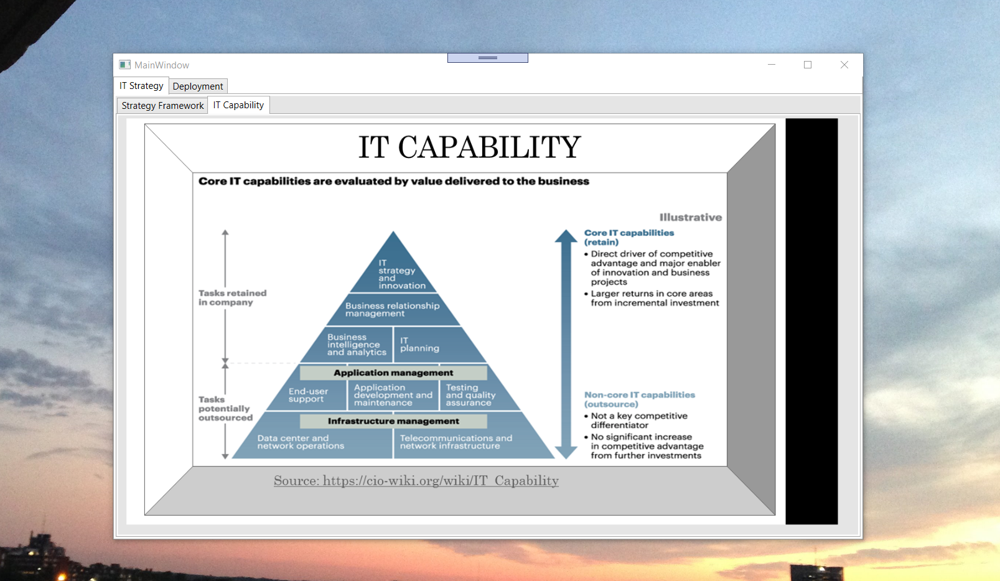
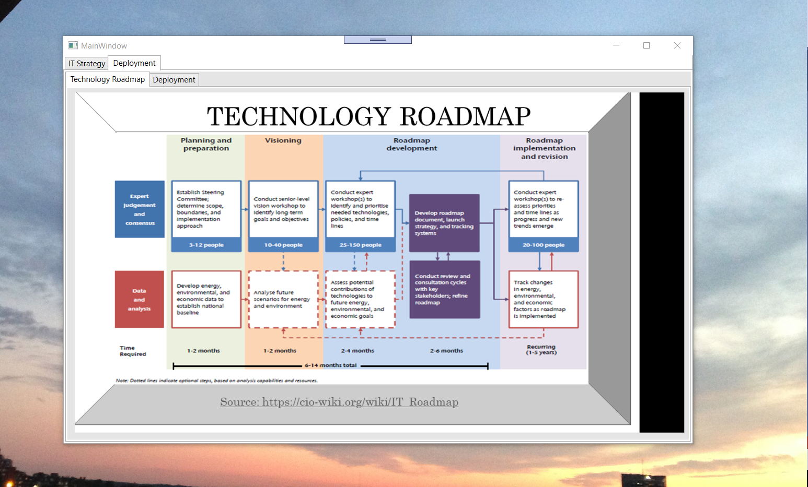

# Deploying IT Strategy

The project provides an introduction to IT strategies. The images are not custom, the source for the images are provided. 

Confidential information is not displayed.

## IT Strategy Framework

## IT Capability

## Technology Roadmap

## Infrastructure and capabilities

## Agile Methodology

## Project IT

## Contents

## Contents II

## Contents III

## Systems Design Analysis

## Systems Design Analysis II

## Business Process Functional Modeling

## Activity Diagram

## Testing Requirement

## UML_Modeling

## Improved Algorithm

## UML Improved Algorithm

Additional reference : https://github.com/alpaddesai/BusinessDevelopmentMergersAcquisitionsIdea
