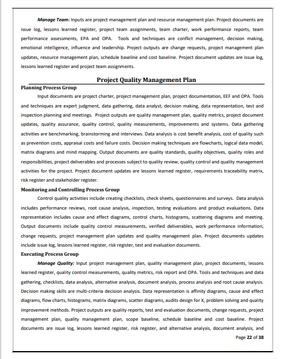
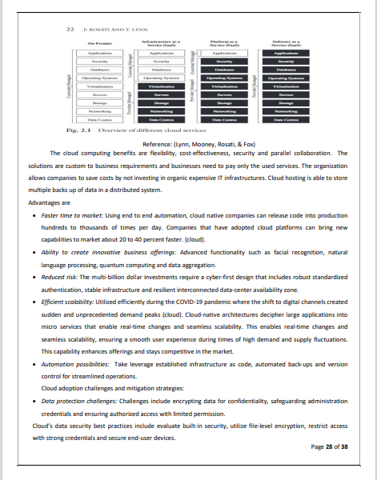
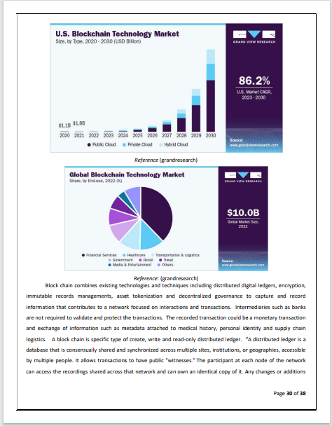

# Deploying IT Strategy

The project provides an introduction to IT strategies. The images are not custom, the source for the images are provided. 
Confidential information is not displayed.

## IT Strategy Framework

## IT Capability

## Technology Roadmap

## Infrastructure and capabilities

## Agile Methodology

## Project IT

## Contents

## Contents II

## Contents III

## Systems Design Analysis

## Systems Design Analysis II

## Business Process Functional Modeling

## Activity Diagram

## Testing Requirement

## UML_Modeling

## Improved Algorithm

## UML Improved Algorithm

## UML Diagrams

## Design Modeling

## PMP Plan 

## Project Scope Management 

## Project Stakeholder Mgmt 

## Project Schedule Mgmt

## Project Risk Mgmt 

## Project Resource Mgmt 

## Monitoring Controlling Process Group 

## Project Quality Management 

## Project Procurement Mgmt

## Project Cost Mgmt

## Project Communication Mgmt 

## Project Communication Mgmt 

## Appendix

## Cloud Computing

## Block Chain 

## Block Chain

## Fin Tech 

## Cyber Security

## Virtual Reality

## Fundamentals Digital Transformation

## Open Loop Payment

## Crypto Currency 

## Digital Transformation

## Bibliography

Additional reference : https://github.com/alpaddesai/BusinessDevelopmentMergersAcquisitionsIdea, https://github.com/alpaddesai/PredictionModelWithBloombergIdea/blob/master/TestCaseMain.cpp, https://github.com/alpaddesai/InvestmentPortfolio, https://github.com/alpaddesai/Algorithms, https://github.com/alpaddesai/JavaObjectOrientedProgramming, https://github.com/alpaddesai/ObjectOrientedDesignProgramming, https://github.com/alpaddesai/ObjectOrientedProgrammingCSharp,  https://github.com/alpaddesai/PortfolioReturnGUIIdea and https://github.com/alpaddesai/GraduateAptitudeTestEngineering_CS.
